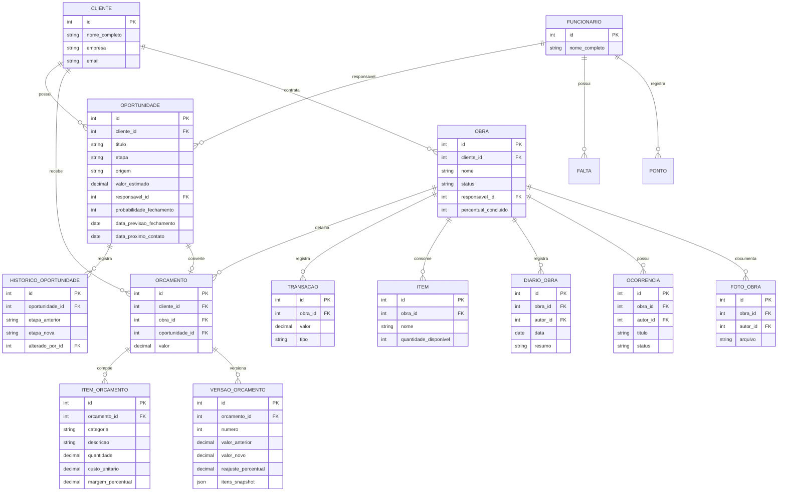

# Diagrama de dados

O CRM conecta o relacionamento comercial ao ciclo operacional da construcao civil:

```mermaid
erDiagram
    CLIENTE ||--o{ OPORTUNIDADE : possui
    FUNCIONARIO ||--o{ OPORTUNIDADE : responsavel
    OPORTUNIDADE ||--o{ HISTORICO_OPORTUNIDADE : registra
    OPORTUNIDADE ||--o| ORCAMENTO : converte
    ORCAMENTO ||--o{ ITEM_ORCAMENTO : compoe
    ORCAMENTO ||--o{ VERSAO_ORCAMENTO : versiona
    CLIENTE ||--o{ ORCAMENTO : recebe
    CLIENTE ||--o{ OBRA : contrata
    OBRA ||--o{ ORCAMENTO : detalha
    OBRA ||--o{ TRANSACAO : registra
    OBRA ||--o{ ITEM : consome
    OBRA ||--o{ DIARIO_OBRA : registra
    OBRA ||--o{ OCORRENCIA : possui
    OBRA ||--o{ FOTO_OBRA : documenta
    FUNCIONARIO ||--o{ FALTA : possui
    FUNCIONARIO ||--o{ PONTO : registra

    CLIENTE {
        int id PK
        string nome_completo
        string empresa
        string email
    }
    FUNCIONARIO {
        int id PK
        string nome_completo
    }
    OPORTUNIDADE {
        int id PK
        int cliente_id FK
        string titulo
        string etapa
        string origem
        decimal valor_estimado
        int responsavel_id FK
        int probabilidade_fechamento
        date data_previsao_fechamento
        date data_proximo_contato
    }
    HISTORICO_OPORTUNIDADE {
        int id PK
        int oportunidade_id FK
        string etapa_anterior
        string etapa_nova
        int alterado_por_id FK
    }
    ORCAMENTO {
        int id PK
        int cliente_id FK
        int obra_id FK
        int oportunidade_id FK
        decimal valor
    }
    ITEM_ORCAMENTO {
        int id PK
        int orcamento_id FK
        string categoria
        string descricao
        decimal quantidade
        decimal custo_unitario
        decimal margem_percentual
    }
    VERSAO_ORCAMENTO {
        int id PK
        int orcamento_id FK
        int numero
        decimal valor_anterior
        decimal valor_novo
        decimal reajuste_percentual
        json itens_snapshot
    }
    OBRA {
        int id PK
        int cliente_id FK
        string nome
        string status
        int responsavel_id FK
        int percentual_concluido
    }
    DIARIO_OBRA {
        int id PK
        int obra_id FK
        int autor_id FK
        date data
        string resumo
    }
    OCORRENCIA {
        int id PK
        int obra_id FK
        int autor_id FK
        string titulo
        string status
    }
    FOTO_OBRA {
        int id PK
        int obra_id FK
        int autor_id FK
        string arquivo
    }
    TRANSACAO {
        int id PK
        int obra_id FK
        decimal valor
        string tipo
    }
    ITEM {
        int id PK
        int obra_id FK
        string nome
        int quantidade_disponivel
    }
```